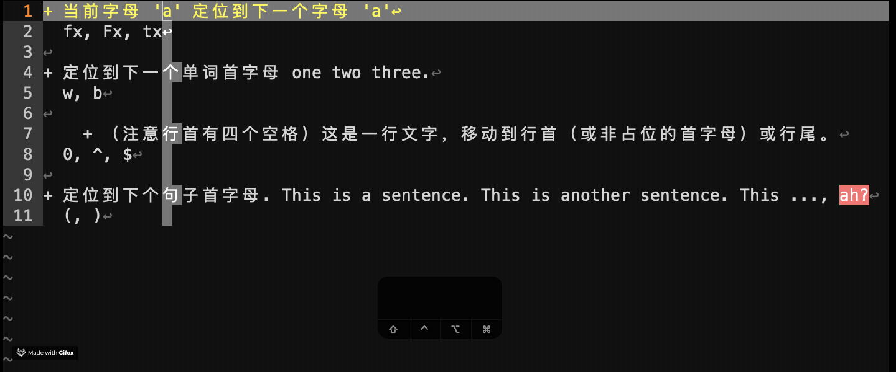
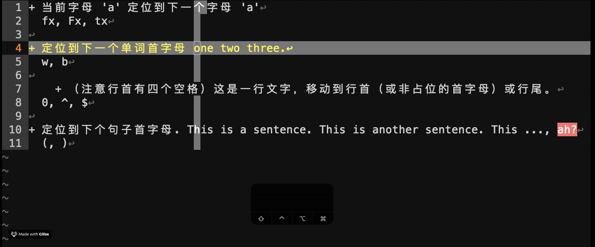
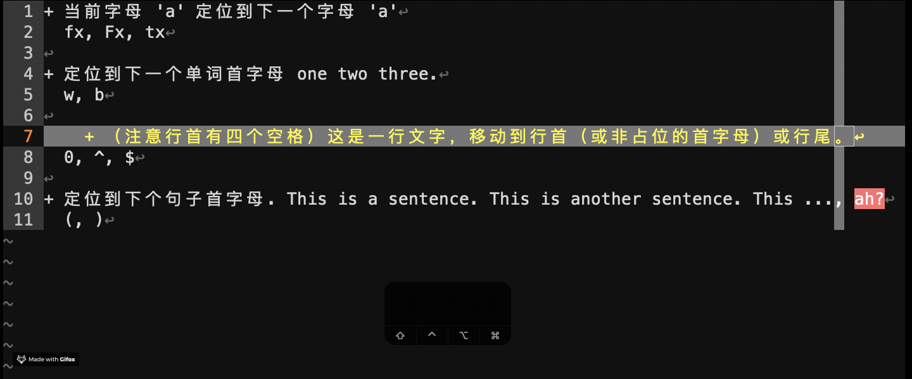
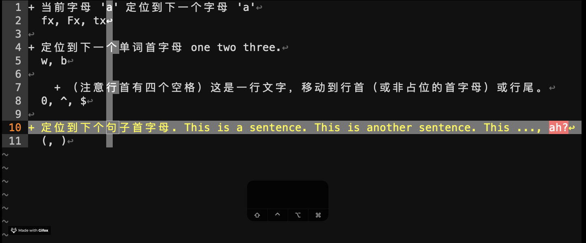
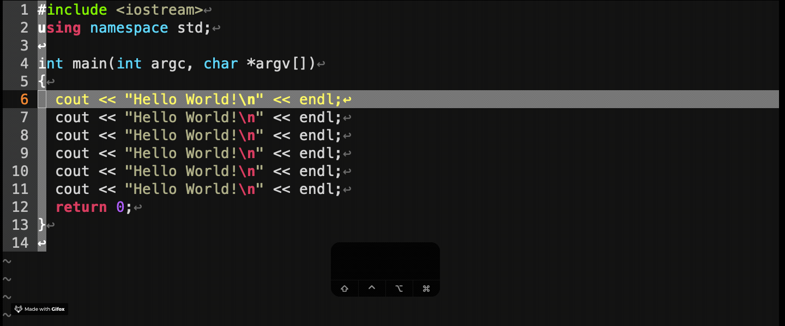
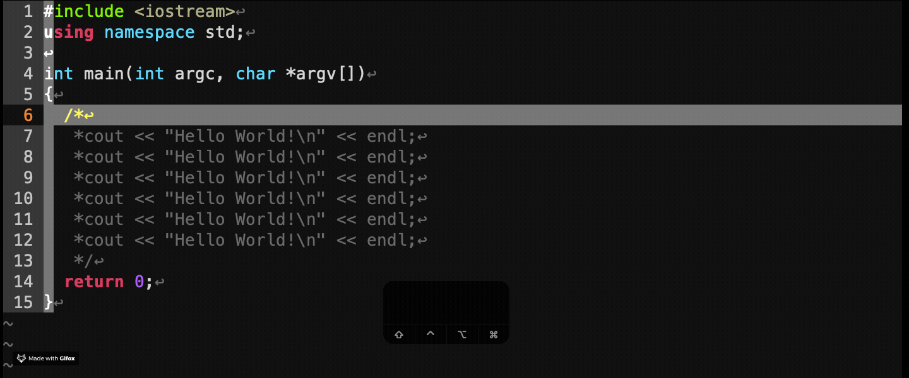
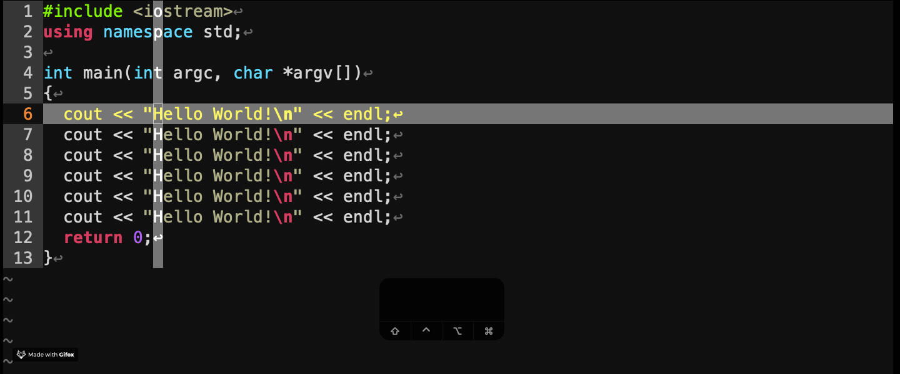
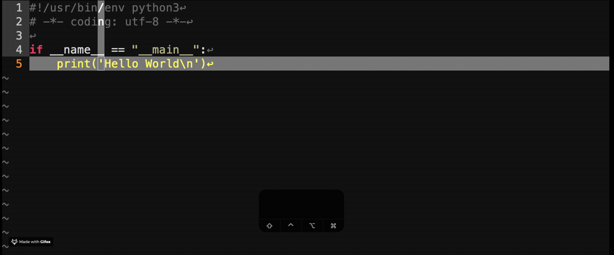

常用 Vim 命令列表
===============

## 移动 (Normal) 正常模式
定位光标到下一个位置，以下命令称为 `motion` 。

|        `motion`        | 演示                           |
| :--------------------: | :----------------------------- |
| `f`*x*, `F`*x*, `t`*x* |         |
|        `w`, `b`        |             |
|     `0`, `$`, `^`      |           |
|        `)`, `(`        |  |

## 输入 (Insert) 插入模式

`i`, `I`, `a`, `A`, `o`, `O`, `c`\<*motion*\>

## 选择 (Visual) 选择模式
| Visual Mode | 演示                         |
| :---------: | :--------------------------- |
| `c` or `s`  |  |
|  `>`, `<`   |      |

## 插件功能

|  NERDCommenter   | 演示                |
| :--------------: | :------------------ |
| \<*count*\>`\cs` |  |
| \<*count*\>`\cu` |  |
------------------------------------------
| vim-multiple-cursors | 演示                 |
| :------------------: | :------------------- |
|        `C-n`         |  |
-----------------------------------------------
|       vim-surround       | 演示                       |
| :----------------------: | :------------------------- |
| `cs`\<*init*\>\<*subs*\> |  |
